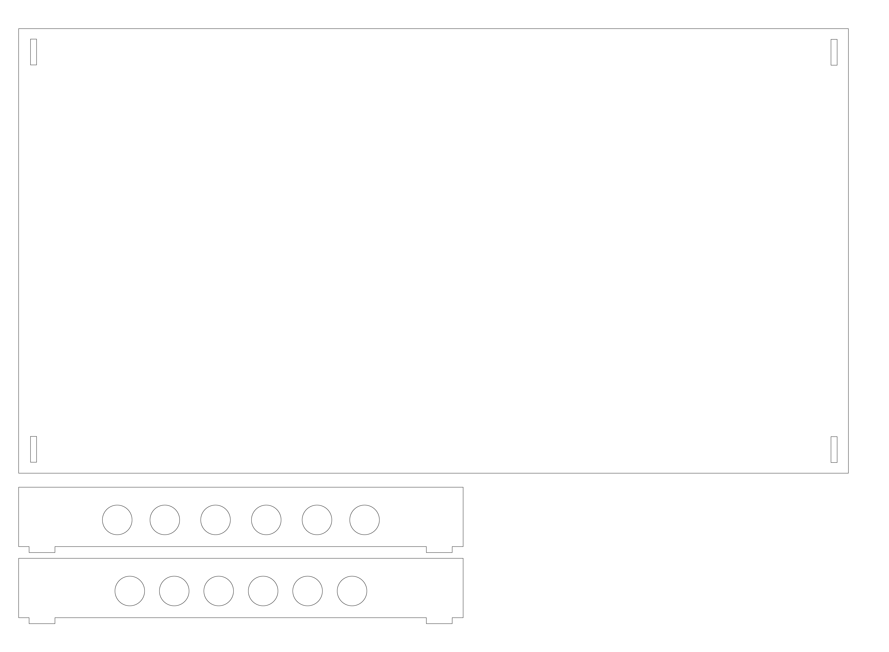

#Lehrstück am Hyperwerk: Testing Evacuated Solar Tubes  
  
  
**Fragen:**  
1. Wie heiss werden die  Tubes ?  
2. Wie viel Wasser wird wie schnell erhitzt? (anfangs Wasser und Luft Temperatur)  
3. Gefrierpunkt der Tubes  
4. Bei welcher Sonneneinstrahlung funktionieren die Tubes?  
5. Energie leitung innen? Energie speicherung der Tubes?  
6. Ausrichtung  
7. Untergrund Weiss oder Spiegel oder Halbröhre/Parabole  
  
  
**Dichtung zum externen erwährmungs System:**  
[Silikonringe die Hitzebeständig:](http://www.hermannwendler.de/industriebedarf/technische-dichtungsmaterialien/dichtungsmaterialien-als-platten-oder-rollenware/hitzebestaendige-dichtungsmaterialien)  
  
  
**Konstruktion aus MDF mit Lasercutter:**  
  
*vacumtubes_lasercutter_plan.png*  

**Vorhandene Komponenten:**
- Evacuated Solar Tubes
- Copper Heat Pipes
- DS1802 Sensor
- D1 mini / PC
- Arduino SD Logger
- ev. WLAN adapter
